# 🗺️ Mapa de Flujo de Escaneo: HADES Surveillance Agent v2.2
### Guía Técnica Visual para el Entendimiento del Ciclo de Auditoría

Este documento detalla el ciclo completo de ejecución que realiza el agente **HADES** desde que haces doble clic en el archivo lanzador o lo invocas desde la terminal. Está diseñado para que cualquier usuario, administrador o pentester entienda exactamente qué comandos se ejecutan bajo el capó, qué datos se extraen y cómo se procesa la información de forma local.

---

## 1. 📊 Diagrama de Flujo del Proceso (Mermaid)

```mermaid
graph TD
    %% Estilos de Nodos
    classDef startEnd fill:#1b1b1b,stroke:#00E676,stroke-width:2px,color:#fff;
    classDef step fill:#2c2c2c,stroke:#29B6F6,stroke-width:1px,color:#fff;
    classDef decision fill:#37474F,stroke:#FFCA28,stroke-width:2px,color:#fff;
    classDef outputs fill:#1b1b1b,stroke:#AB47BC,stroke-width:1px,color:#d580ff;

    Start([Double Click: LANZAR_HADES.bat]) ---> Prep[Autodetección de Subred Local <br> get_local_ip]
    Prep ---> F1[FASE 1: Barrido de red ARP <br> Nmap discovery]
    F1 ---> F2[FASE 2: Captura pasiva live <br> Tshark Sniff 30s]
    F2 ---> IA1[Análisis IA del Tráfico <br> Ollama Engine]
    IA1 ---> F3[FASE 3: Actualizar Templates <br> Nuclei update]
    F3 ---> Menu{¿Qué desea auditar el Pentester?}
    
    %% Decisiones del Menú
    Menu -- "Opción ID [Host Único]" --> F4_Single[FASE 4: Auditoría Enfocada <br> Solo host elegido]
    Menu -- "Opción 'A' [Red Completa]" --> F4_All[FASE 4: Auditoría Masiva <br> Todos los hosts secuencialmente]
    Menu -- "Opción 'Q' [Salir]" --> End[Guardar Reporte Parcial de Tráfico y Salir]

    %% Flujo de Auditoría por IP
    F4_Single ---> NmapDeep[1. Nmap Deep Scan <br> Puertos, servicios y OS]
    F4_All ---> NmapDeep
    
    NmapDeep ---> WebCheck{¿Hay puertos web abiertos? <br> 80, 443, 8080, etc.}
    WebCheck -- Sí --> NucleiWeb[2. Escaneo de Vulnerabilidades Web <br> Nuclei Web Vuln]
    WebCheck -- No ---> SSLCheck
    NucleiWeb ---> SSLCheck{¿Hay puertos SSL/TLS? <br> 443, 8443, etc.}
    
    SSLCheck -- Sí --> OpenSSL[3. Auditoría SSL <br> OpenSSL s_client]
    SSLCheck -- No ---> IA2[4. Análisis IA del Host <br> Recomendaciones ISO 27001]
    OpenSSL ---> IA2

    %% Generación de Reportes
    IA2 ---> F5[FASE 5: Consolidación e Informe Maestro]
    F5 ---> OpenExplorer[Apertura de la Carpeta de Informes]
    OpenExplorer ---> End
    
    %% Asignación de Clases
    class Start,End startEnd;
    class Prep,F1,F2,IA1,F3,NmapDeep,NucleiWeb,OpenSSL,IA2,F5,OpenExplorer step;
    class Menu,WebCheck,SSLCheck decision;
```



---

## 2. 📝 Explicación Paso a Paso de las Fases

### 🔹 Paso 0: Inicialización y Autodetección
* **Qué hace el agente:** Abre un socket local para determinar la IP actual del equipo en su tarjeta activa (Wi-Fi o Ethernet) y extrapola el rango `/24` correspondiente.
* **Comando bajo el capó:** `socket.connect(('8.8.8.8', 1))` (Operación interna del sistema operativo, no genera tráfico en la red).
* **Resultado:** Detecta el rango objetivo (por ejemplo, `192.168.1.0/24`).

### 🔹 Fase 1: Barrido de Red ARP (ARP Discovery)
* **Qué hace el agente:** Realiza un mapeo rápido de la LAN para listar todos los dispositivos que están encendidos y respondiendo peticiones ARP.
* **Comando bajo el capó:** 
  ```bash
  "C:\Program Files (x86)\Nmap\nmap.exe" -sn -PR -PE -PS22,80,443,445,8080,8443 192.168.1.0/24
  ```
* **Resultado:** Se extrae una lista limpia de IPs activas en la red.

### 🔹 Fase 2: Captura Silenciosa de Tráfico (Live Traffic Capture)
* **Qué hace el agente:** Autodetecta la tarjeta activa y captura los paquetes que pasan por el canal durante 30 segundos. Analiza las conexiones, IPs de destino en Internet, y protocolos utilizados por tus equipos.
* **Comando bajo el capó:**
  ```bash
  "C:\Program Files\Wireshark\tshark.exe" -i "Wi-Fi" -a duration:30 -T fields -e ip.src -e ip.dst -e tcp.dstport -e udp.dstport -e _ws.col.Protocol -E separator=tab
  ```
* **Resultado:** Se crea un mapa de flujos locales e interacciones externas, el cual es enviado a la IA local (Ollama) para detectar fugas de datos, telemetría sospechosa o conexiones no autorizadas.

### 🔹 Fase 3: Sincronización de Firmas
* **Qué hace el agente:** Actualiza la base de datos de firmas locales de vulnerabilidades web para garantizar que el motor Nuclei detecte las amenazas más recientes.
* **Comando bajo el capó:** 
  ```bash
  "%USERPROFILE%\Documents\HADES\nuclei\nuclei.exe" -update-templates -silent
  ```

---

## 3. 🎯 El Punto de Decisión: El Menú Táctico
Una vez recopilada la información pasiva y los hosts activos, HADES se detiene y te cede el control. La consola te muestra un menú interactivo:

| Opción de Entrada | Comportamiento del Agente | Recomendado Para... |
| :--- | :--- | :--- |
| **`[Número del Host]`** (Ej: `2`) | El escaneo activo profundo se ejecutará **únicamente** en esa dirección IP, evitando interactuar con el resto de la red. | Redes corporativas o análisis de un dispositivo específico sospechoso. |
| **`[A] Escanear Todos`** | Audita uno por uno todos los dispositivos activos secuencialmente. | Redes domésticas o laboratorios controlados donde se quiere mapear todo. |
| **`[Q] Salir`** | Detiene el flujo de forma segura. Guarda solo el tráfico pasivo de la Fase 2 y no ejecuta escaneos agresivos en la red. | Retirarse silenciosamente sin activar alarmas de IDS/IPS. |

---

## 4. 🔬 Ejecución de la Auditoría Profunda (Fase 4)
Para cada host objetivo seleccionado, se lanza una auditoría en 4 etapas:

### 1️⃣ Nmap Deep Scan
* **Objetivo:** Descubrir puertos, verificar versiones de software del sistema operativo y lanzar scripts de diagnóstico de vulnerabilidades comunes.
* **Comando:** `"C:\Program Files (x86)\Nmap\nmap.exe" -T4 -F -A --script vuln <IP>`

### 2️⃣ Nuclei Web Vulnerability Scan *(Si hay puertos web abiertos)*
* **Objetivo:** Ejecutar auditorías web buscando fallos de configuración, fugas de credenciales, CVEs críticos y exposiciones en paneles de administración.
* **Comando:** `"...\nuclei.exe" -u http://<IP>:<Port> -t cves,exposures,vulnerabilities,misconfiguration -silent -timeout 8 -retries 1 -j`

### 3️⃣ Auditoría SSL/TLS *(Si hay HTTPS expuesto)*
* **Objetivo:** Analizar los certificados de seguridad instalados y el cifrado utilizado para asegurar que la conexión no sea susceptible a ataques Man-in-the-Middle.
* **Comando:** `echo | "C:\Program Files\OpenSSL-Win64\bin\openssl.exe" s_client -connect <IP>:<Port> -showcerts`

### 4️⃣ Análisis e Informe de IA Local (ISO 27001)
* **Objetivo:** Consolidar todos los logs anteriores (Nmap + Nuclei + SSL) y enviárselos al motor de IA local (Ollama) para que actúe como un auditor certificado ISO 27001 y genere recomendaciones en lenguaje humano.

---

## 5. 📂 Fase 5: Consolidación de Resultados
Toda la información obtenida es parseada y guardada en formato estructurado en un subdirectorio dedicado dentro de la carpeta `informes/`.

```
📂 informes/
 ┗ 📂 informe_20260521_2310/  <-- Carpeta única por ejecución
   ┣ 📄 INFORME_MAESTRO.md    <-- Informe consolidado con diagramas de red y análisis de la IA
   ┣ 📄 trafico_red.txt       <-- Registro completo de tráfico, IPs externas y protocolos
   ┣ 📄 host_192_168_1_1.txt  <-- Resultados de auditoría y análisis de IA para el Router
   ┗ 📄 host_192_168_1_83.txt <-- Resultados específicos del endpoint seleccionado
```

Una vez finalizado, HADES abre automáticamente tu Explorador de Windows apuntando a este directorio para que puedas revisar cómodamente los informes en formato Markdown.
