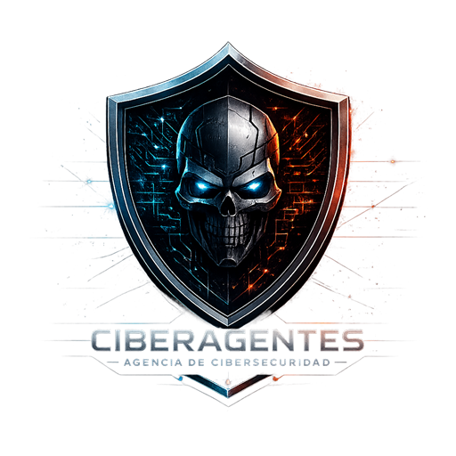

<div align="center">



# HADES SOC Dashboard

**Agente local de auditoría de red con dashboard táctico estilo SOC e informe ejecutivo ISO/IEC 27001**


*Por **CIBERAGENTES — Agencia de Ciberseguridad***

</div>

---

## 📖 Descripción

**HADES SOC Dashboard** es un agente de auditoría de red **100 % local** (sin nube, sin API keys externas) que orquesta herramientas estándar de ciberseguridad en un pipeline robusto y reproducible. Descubre los dispositivos de una red, analiza sus servicios y vulnerabilidades, captura tráfico y consolida todo en **un único informe ejecutivo en formato `.docx` alineado a ISO/IEC 27001:2022**.

Incluye un **dashboard web táctico** (estilo centro de operaciones de seguridad) para lanzar y monitorizar las auditorías, con mapa de red, monitores de recursos y consola en tiempo real.

> El análisis con IA (Ollama local) es **consultivo, nunca decisorio**: el cálculo de riesgo es determinista y basado en evidencia.

---

## ✨ Características

- 🖥️ **Dashboard web** local y seguro (token CSRF por sesión, servidor multihilo).
- 🔍 **Descubrimiento de red** con Nmap (ARP) y escaneo de puertos, servicios y SO.
- 🛡️ **Detección de vulnerabilidades web** con Nuclei (plantillas CVE/exposiciones/misconfiguración).
- 📡 **Captura y análisis de tráfico** con Tshark.
- 🔐 **Auditoría TLS/SSL** con OpenSSL.
- 🤖 **Análisis consultivo con IA local** (Ollama), nunca decisorio.
- 📄 **Informe ejecutivo ISO/IEC 27001** en `.docx`: resumen ejecutivo, hallazgos por activo, mapeo a controles del Anexo A, recomendaciones priorizadas — **con tu marca**.
- 🧱 **Pipeline robusto**: timeouts acotados, guardado incremental, degradación elegante si falta una herramienta, sin bloqueos.

---

## 🧩 Arquitectura

| Componente | Rol |
|-----------|-----|
| `hades_server.py` | Servidor web del dashboard (puerto 8080, multihilo, token de sesión). |
| `agente HADES.html` | Interfaz del dashboard (mapa de red, monitores, consola). |
| `hades_surveillance_advanced.py` | Orquestador del pipeline de auditoría (Fases 1→6). |
| `hades_win_master_advanced.py` | Motor: Nmap, Nuclei, Tshark, OpenSSL e IA (Ollama). |
| `hades_report_docx.py` | Generador del informe ejecutivo ISO/IEC 27001 (`.docx`). |
| `LANZAR_DASHBOARD.bat` | Inicia el dashboard web. |
| `LANZAR_HADES.bat` | Ejecuta una auditoría completa por consola. |
| `DETENER_HADES.bat` | Parada de emergencia (mata procesos del agente). |

---

## ⚙️ Requisitos

- **Windows 10/11** y **Python 3.10+**
- Dependencia Python: `pip install python-docx` (para el informe) — opcional `psutil` (monitores).
- Herramientas externas (instálalas en sus rutas estándar):
  - [Nmap](https://nmap.org/download.html) → `C:\Program Files (x86)\Nmap\nmap.exe`
  - [Wireshark/Tshark](https://www.wireshark.org/) → `C:\Program Files\Wireshark\tshark.exe`
  - [OpenSSL](https://slproweb.com/products/Win32OpenSSL.html) → `C:\Program Files\OpenSSL-Win64\bin\openssl.exe`
  - [Nuclei](https://github.com/projectdiscovery/nuclei) → `%USERPROFILE%\Documents\HADES\nuclei\nuclei.exe`
  - [Ollama](https://ollama.com/) escuchando en `http://127.0.0.1:11434`
- Plantillas Nuclei en `%USERPROFILE%\nuclei-templates` (`nuclei -update-templates`).

> Las rutas de Nuclei se resuelven contra tu perfil de usuario automáticamente. nmap/tshark/openssl usan rutas estándar; edita `WIN_PATHS` en `hades_win_master_advanced.py` si instalaste en otra ubicación.

---

## 🚀 Uso

**Dashboard (recomendado):**
```bat
LANZAR_DASHBOARD.bat
```
Abre el navegador en el panel, configura el modo (auto/completo/custom) y pulsa **Iniciar**. La consola muestra el progreso en vivo.

**Auditoría por consola:**
```bat
LANZAR_HADES.bat
```

Al terminar, los resultados quedan en `informes\informe_<fecha>\`:
- `INFORME_EJECUTIVO_ISO27001.docx` — informe ejecutivo con tu marca.
- `INFORME_MAESTRO.md` — consolidado técnico.
- `trafico_red.txt` — captura de tráfico.

Regenerar el informe ejecutivo desde un consolidado existente:
```bat
python hades_report_docx.py informes\informe_<fecha>\INFORME_MAESTRO.md
```

---

## 🎨 Personalizar la marca

Edita el bloque `BRANDING` al inicio de `hades_report_docx.py`:
```python
BRANDING = {
    "company_name": "TU EMPRESA",
    "logo_path":    "ruta/a/tu/logo.png",   # vacío = se omite
    "primary":   (0x12, 0x22, 0x33),         # tus colores corporativos
    ...
}
```

---

## 🔒 Privacidad

Los resultados de las auditorías (`informes/`) contienen datos sensibles de la red analizada (IPs, MACs, puertos, servicios). Están **excluidos del control de versiones** mediante `.gitignore` y **no se publican** en este repositorio.

---

## ⚖️ Aviso legal

Esta herramienta está destinada **exclusivamente a auditorías de seguridad autorizadas**. Úsala **solo en redes y sistemas de tu propiedad o sobre los que tengas permiso explícito por escrito**. El escaneo de redes ajenas sin autorización puede ser ilegal en tu jurisdicción (p. ej. en Chile, Ley 21.459 de Delitos Informáticos; a nivel internacional, Convenio de Budapest). Los autores no se hacen responsables del mal uso. **Tú eres el único responsable del uso que le des.**

---

## 📜 Licencia

Distribuido bajo licencia **MIT**. Ver [`LICENSE`](LICENSE).

---

<div align="center">

**CIBERAGENTES — Agencia de Ciberseguridad**

</div>
