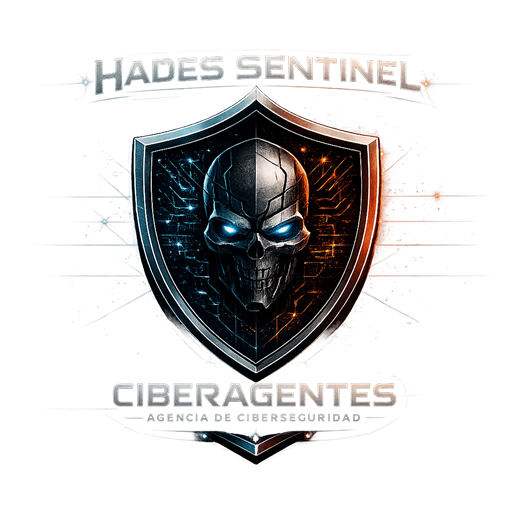
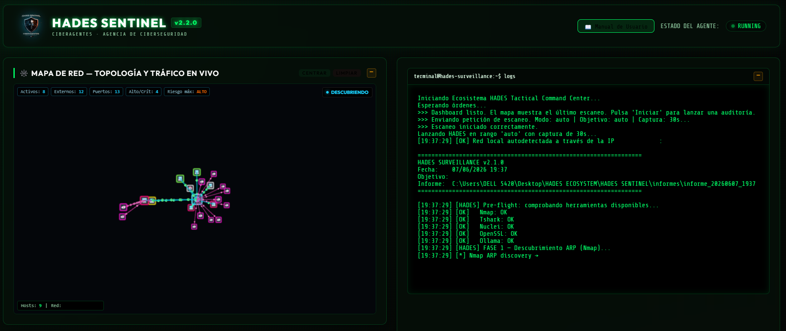
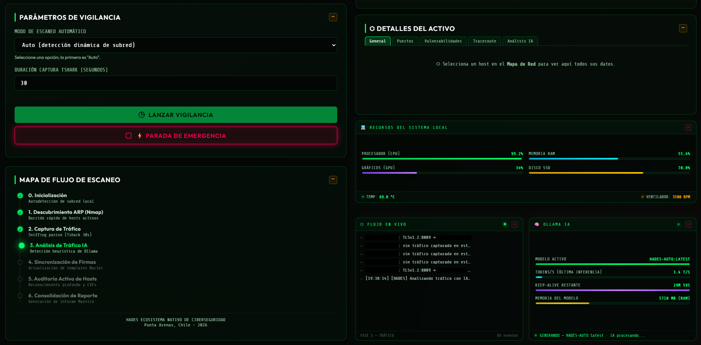
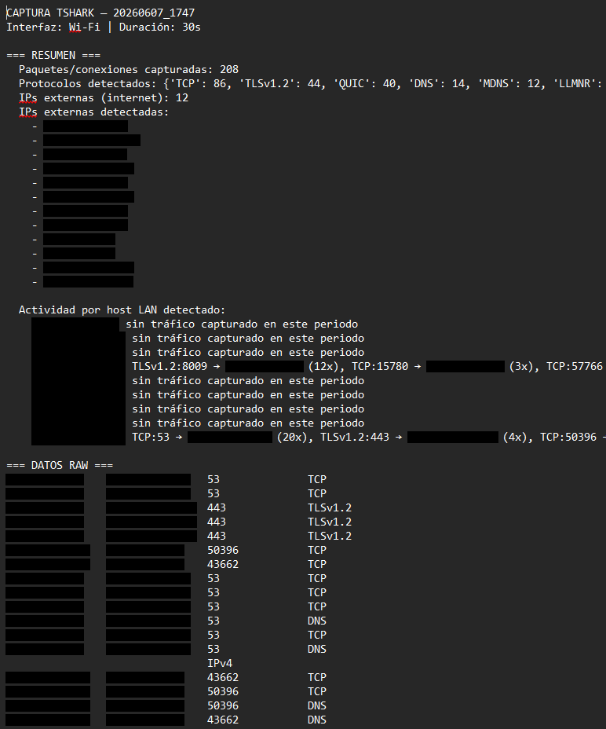
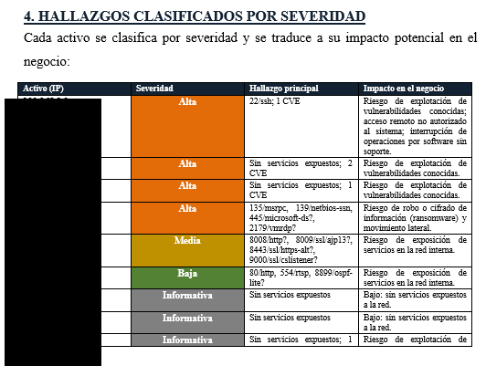
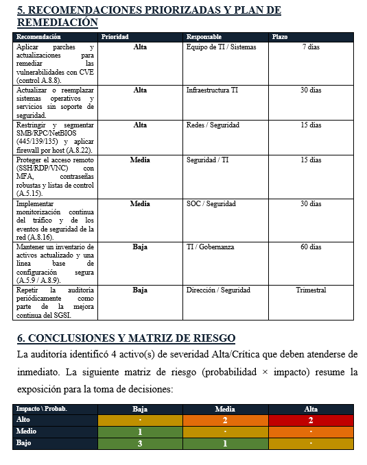
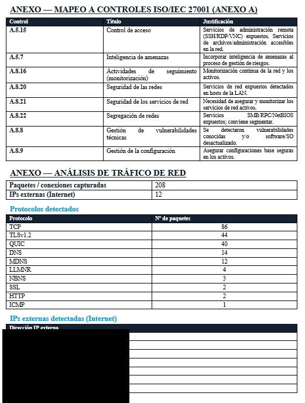

<div align="center">



# HADES SENTINEL

### **From vulnerabilities to ISO 27001 compliance in one click.**

🇬🇧 **English** &nbsp;|&nbsp; 🇪🇸 [Español](#-español)

[](#-license)
[](#)
[](#)
[](#)
[](https://github.com/Lordhades26/HADES_SENTINEL/stargazers)
[](https://github.com/Lordhades26/HADES_SENTINEL/issues)

**The 100% local network audit agent that turns a live LAN scan into a white-labeled, ISO 27001:2022-aligned executive report — for CISOs, compliance teams, and pentesters who can't send data to the cloud.**

**🖥️ The audit in action — what runs on your network (100% on-premise, zero cloud)**

<table>
  <tr>
    <td align="center"><br><sub><b>Live network map + console</b><br>9 hosts, 12 external IPs, 4 critical findings detected in real time</sub></td>
    <td align="center"><br><sub><b>Control panel + local AI</b><br>5-phase scan flow, CPU/GPU/RAM monitors, Ollama LLM running on-device</sub></td>
    <td align="center"><br><sub><b>Live traffic capture</b><br>Tshark sniff with protocol breakdown and per-host activity</sub></td>
  </tr>
</table>

**📄 What your business receives — board-ready, audit-ready, white-labeled with your brand**

<table>
  <tr>
    <td align="center"><br><sub><b>Findings by severity</b><br>every asset classified Critical / High / Medium / Low with business impact</sub></td>
    <td align="center"><br><sub><b>Color-coded risk matrix</b><br>probability × impact, deterministic scoring, board-ready</sub></td>
    <td align="center"><br><sub><b>ISO 27001 Annex A mapping</b><br>findings auto-mapped to controls A.5.x / A.8.x — saves weeks per audit</sub></td>
  </tr>
</table>

### ⭐ Star this repo if it saved you a compliance audit.

</div>

---

## 🎯 Why HADES?

- 🧾 **Compliance teams waste weeks** manually mapping technical findings to ISO 27001 Annex A controls. SENTINEL produces the mapping automatically, in one `.docx`.
- 🛠️ **Pentest tools don't speak ISO.** Nmap, Nuclei and friends emit raw evidence. SENTINEL orchestrates them and translates the output into the language an auditor signs off on.
- 🔒 **Cloud scanners leak your network topology** to third-party SaaS. SENTINEL runs 100% on-prem: zero data egress, no API keys, no telemetry. Built for environments where uploading scan data is illegal or fireable.

---

## 📦 What you get

Every audit produces a timestamped folder containing:

1. **Executive Report** — `INFORME_EJECUTIVO_ISO27001.docx` aligned to ISO/IEC 27001:2022, white-labeled with your brand.
2. **Technical Consolidated Report** — `INFORME_MAESTRO.md` with full evidence, host-by-host.
3. **Risk Matrix** — color-coded (critical / high / medium / low) with deterministic scoring.
4. **Traffic Capture** — `trafico_red.txt` with flows, ports, protocols and external endpoints contacted.
5. **ISO 27001 Annex A Control Mapping** — each finding tied to its corresponding control (A.5–A.8).
6. **Per-Host Detail Reports** — `host_XXX_XXX_XXX_XXX.txt` with ports, banners, TLS audit and CVE matches.

---

## 🚀 Quick start

```bash
# 1. Clone
git clone https://github.com/Lordhades26/HADES_SENTINEL.git
cd HADES_SENTINEL

# 2. Install Python deps
pip install python-docx psutil

# 3. Install external tools (one-liner via winget)
winget install Insecure.Nmap WiresharkFoundation.Wireshark ShiningLight.OpenSSL.Light Ollama.Ollama
# Nuclei: download from https://github.com/projectdiscovery/nuclei/releases
#         → extract to %USERPROFILE%\Documents\HADES\nuclei\nuclei.exe
#         → run: nuclei -update-templates

# 4. Launch the tactical dashboard
LANZAR_DASHBOARD.bat

# 5. Open http://127.0.0.1:8080 — the session token is injected automatically.
```

Prefer headless? Run `LANZAR_HADES.bat` for a full pipeline audit in console mode.

---

## 🧠 How it works

A deterministic 5-phase pipeline. The AI layer (local Ollama) is **consultative-only** — risk scoring stays evidence-based.

```
[FASE 1: ARP Sweep] ────> Discover active hosts on the LAN (Nmap)
         │
[FASE 2: Live Tshark] ──> Capture live traffic (30s default)
         │
[FASE 3: Nuclei Update] > Pull latest CVE / misconfig templates
         │
  [TACTICAL MENU] <────> Pentester picks scope (single host or full subnet)
         │
         ├──> [Host ID] ──> FASE 4: Deep audit of one host
         │                  FASE 5: Per-host report
         │
         └──> [Option A] ─> FASE 4: Mass deep audit across the subnet
                            FASE 5: Consolidated INFORME_MAESTRO.md + ISO .docx
```

**Phase 4 per host runs:** deep Nmap (ports, services, OS) → Nuclei (web vulns) → OpenSSL (TLS audit) → Ollama (consultative analysis only).

---

## 🎨 Customize your brand (white-label compliance)

Open `hades_report_docx.py` and edit the `BRANDING` dict at the top:

```python
BRANDING = {
    "company_name": "YOUR COMPANY",
    "logo_path":    "assets/your_logo.png",   # leave empty to skip
    "primary":      (0x12, 0x22, 0x33),       # corporate hex → RGB tuple
    "accent":       (0xC0, 0x39, 0x2B),
    "footer_text":  "CONFIDENTIAL — for internal use only",
}
```

Every `.docx` report now ships with your customer's logo, colors and footer. Resell the audit under your own brand.

---

## 🏗️ Architecture

| File | Role |
|------|------|
| `hades_server.py` | Dashboard backend (port 8080, CSRF-protected, multi-thread). |
| `hades_surveillance_advanced.py` | Pipeline orchestrator (5 phases). |
| `hades_win_master_advanced.py` | Tool engine — Nmap, Nuclei, Tshark, OpenSSL, Ollama. |
| `hades_report_docx.py` | ISO 27001:2022 `.docx` report generator. |
| `LANZAR_DASHBOARD.bat` | One-click dashboard launcher. |
| `LANZAR_HADES.bat` | One-click console audit. |
| `DETENER_HADES.bat` | Emergency stop (kills all agent processes cleanly). |

External binaries are resolved from `WIN_PATHS` in `hades_win_master_advanced.py` — edit it if you installed Nmap/Tshark/OpenSSL/Nuclei in a non-standard path.

---

## 🔐 Security & Privacy

- **100% local execution.** No cloud calls, no API keys, no telemetry. Verify with Tshark — the agent does not phone home.
- **CSRF-protected dashboard.** Single-use session token injected into the browser at launch; no external client can hit the API.
- **WebAuthn biometric auth** (Windows Hello) for dashboard access.
- **AI is consultative, never decisive.** Ollama runs locally on `127.0.0.1:11434`. Risk scoring is deterministic and traceable to evidence.
- **`.gitignore` excludes `informes/`** — scan results (IPs, MACs, banners, TLS data) never leak into version control.
- **Clean shutdown** kills every spawned binary (`nmap.exe`, `tshark.exe`, `nuclei.exe`, `openssl.exe`, `python*.exe`) — no orphan processes.

---

## ⚖️ Legal notice

For **authorized security audits only**. Use exclusively on networks and systems you own or have explicit written permission to test. Unauthorized scanning may be illegal in your jurisdiction (e.g. Chile Law 21.459, EU Budapest Convention, US CFAA). The authors accept no liability for misuse. **You are solely responsible for how you use this tool.**

---

## 📜 License

Dual-licensed under **MIT OR Apache-2.0**. Pick whichever fits your project. See [`LICENSE`](LICENSE) and [`LICENSE-APACHE`](LICENSE-APACHE).

---

## 🤝 Contributing

PRs, issues and feature requests are welcome. Please read [`CONTRIBUTING.md`](CONTRIBUTING.md) and use the templates in [`.github/ISSUE_TEMPLATE/`](.github/ISSUE_TEMPLATE/) before opening an issue.

Using HADES in your organization? [Open an issue](https://github.com/Lordhades26/HADES_SENTINEL/issues/new) and tell us — we'll feature your use case (with permission).

---

<div align="center">

### ⭐ Found this useful? **[Star the repo](https://github.com/Lordhades26/HADES_SENTINEL/stargazers)** — it's the single biggest signal that keeps this project alive.

</div>

---
---

# 🇪🇸 Español

<div align="center">


# HADES SENTINEL

### **De vulnerabilidades a compliance ISO 27001 en un click.**

[](#-licencia)
[](#)
[](#)
[](#)

**El agente local de auditoría de red que convierte un escaneo LAN en vivo en un informe ejecutivo `.docx` con tu marca, alineado a ISO 27001:2022 — para CISOs, equipos de compliance y pentesters que no pueden enviar datos a la nube.**

**🖥️ La auditoría en acción — lo que corre en tu red (100 % on-premise, cero nube)**

<table>
  <tr>
    <td align="center"><br><sub><b>Mapa de red + consola en vivo</b><br>9 hosts, 12 IPs externas, 4 hallazgos críticos detectados en tiempo real</sub></td>
    <td align="center"><br><sub><b>Panel de control + IA local</b><br>flujo de 5 fases, monitores CPU/GPU/RAM, Ollama LLM en el dispositivo</sub></td>
    <td align="center"><br><sub><b>Captura de tráfico en vivo</b><br>sniffing Tshark con desglose por protocolo y actividad por host</sub></td>
  </tr>
</table>

**📄 Lo que tu negocio recibe — listo para directorio, listo para auditoría, con tu marca**

<table>
  <tr>
    <td align="center"><br><sub><b>Hallazgos por severidad</b><br>cada activo clasificado Crítico / Alto / Medio / Bajo con impacto al negocio</sub></td>
    <td align="center"><br><sub><b>Matriz de riesgo coloreada</b><br>probabilidad × impacto, scoring determinista, lista para directorio</sub></td>
    <td align="center"><br><sub><b>Mapeo a ISO 27001 Anexo A</b><br>hallazgos auto-mapeados a controles A.5.x / A.8.x — ahorra semanas por auditoría</sub></td>
  </tr>
</table>

### ⭐ Dale star si te ahorró una auditoría de compliance.

</div>

---

## 🎯 ¿Por qué HADES?

- 🧾 **Los equipos de compliance pierden semanas** mapeando hallazgos técnicos a los controles del Anexo A de ISO 27001. SENTINEL genera el mapeo automáticamente en un único `.docx`.
- 🛠️ **Las herramientas de pentest no hablan ISO.** Nmap, Nuclei y compañía emiten evidencia cruda. SENTINEL las orquesta y traduce la salida al idioma que firma un auditor.
- 🔒 **Los escáneres en la nube filtran la topología de tu red** a SaaS de terceros. SENTINEL corre 100 % on-premise: cero egreso de datos, sin API keys, sin telemetría. Pensado para entornos donde subir datos de escaneo es ilegal o despido directo.

---

## 📦 Lo que obtienes

Cada auditoría crea una carpeta con marca temporal que contiene:

1. **Informe Ejecutivo** — `INFORME_EJECUTIVO_ISO27001.docx` alineado a ISO/IEC 27001:2022, con tu marca.
2. **Informe Técnico Consolidado** — `INFORME_MAESTRO.md` con evidencia completa, host por host.
3. **Matriz de Riesgo** — coloreada (crítico / alto / medio / bajo) con scoring determinista.
4. **Captura de Tráfico** — `trafico_red.txt` con flujos, puertos, protocolos y endpoints externos contactados.
5. **Mapeo a Controles del Anexo A de ISO 27001** — cada hallazgo ligado a su control correspondiente (A.5–A.8).
6. **Reportes de Detalle por Host** — `host_XXX_XXX_XXX_XXX.txt` con puertos, banners, auditoría TLS y CVE detectadas.

---

## 🚀 Inicio rápido

```bash
# 1. Clonar
git clone https://github.com/Lordhades26/HADES_SENTINEL.git
cd HADES_SENTINEL

# 2. Instalar dependencias Python
pip install python-docx psutil

# 3. Instalar herramientas externas (one-liner con winget)
winget install Insecure.Nmap WiresharkFoundation.Wireshark ShiningLight.OpenSSL.Light Ollama.Ollama
# Nuclei: descarga desde https://github.com/projectdiscovery/nuclei/releases
#         → extrae a %USERPROFILE%\Documents\HADES\nuclei\nuclei.exe
#         → ejecuta: nuclei -update-templates

# 4. Lanzar el dashboard táctico
LANZAR_DASHBOARD.bat

# 5. Abre http://127.0.0.1:8080 — el token de sesión se inyecta solo.
```

¿Prefieres modo headless? Ejecuta `LANZAR_HADES.bat` para una auditoría completa en consola.

---

## 🧠 Cómo funciona

Pipeline determinista de 5 fases. La capa de IA (Ollama local) es **consultiva, nunca decisoria** — el scoring de riesgo se mantiene basado en evidencia.

```
[FASE 1: ARP Sweep] ────> Descubre hosts activos en la LAN (Nmap)
         │
[FASE 2: Live Tshark] ──> Captura tráfico en vivo (30s por defecto)
         │
[FASE 3: Nuclei Update] > Descarga últimas plantillas CVE/misconfig
         │
  [MENU TACTICO] <─────> El pentester elige el alcance (host único o subred)
         │
         ├──> [ID Host] ──> FASE 4: Auditoría profunda de un host
         │                  FASE 5: Reporte por host
         │
         └──> [Opción A] ─> FASE 4: Auditoría masiva de la subred
                            FASE 5: INFORME_MAESTRO.md + .docx ISO consolidados
```

**La Fase 4 por host ejecuta:** Nmap profundo (puertos, servicios, SO) → Nuclei (vulns web) → OpenSSL (auditoría TLS) → Ollama (análisis consultivo).

---

## 🎨 Personaliza tu marca (compliance white-label)

Abre `hades_report_docx.py` y edita el dict `BRANDING` al inicio:

```python
BRANDING = {
    "company_name": "TU EMPRESA",
    "logo_path":    "assets/tu_logo.png",     # vacío = se omite
    "primary":      (0x12, 0x22, 0x33),       # hex corporativo → RGB
    "accent":       (0xC0, 0x39, 0x2B),
    "footer_text":  "CONFIDENCIAL — uso interno",
}
```

Cada informe `.docx` lleva el logo, colores y pie de página de tu cliente. Revende la auditoría bajo tu propia marca.

---

## 🏗️ Arquitectura

| Archivo | Rol |
|---------|-----|
| `hades_server.py` | Backend del dashboard (puerto 8080, CSRF, multihilo). |
| `hades_surveillance_advanced.py` | Orquestador del pipeline (5 fases). |
| `hades_win_master_advanced.py` | Motor de herramientas — Nmap, Nuclei, Tshark, OpenSSL, Ollama. |
| `hades_report_docx.py` | Generador del informe ISO 27001:2022 `.docx`. |
| `LANZAR_DASHBOARD.bat` | Lanzador del dashboard en un click. |
| `LANZAR_HADES.bat` | Auditoría por consola en un click. |
| `DETENER_HADES.bat` | Parada de emergencia (cierre limpio de procesos). |

Los binarios externos se resuelven desde `WIN_PATHS` en `hades_win_master_advanced.py` — edítalo si instalaste Nmap/Tshark/OpenSSL/Nuclei en rutas no estándar.

---

## 🔐 Seguridad y Privacidad

- **Ejecución 100 % local.** Sin llamadas a la nube, sin API keys, sin telemetría. Verifícalo con Tshark — el agente no telefonea a casa.
- **Dashboard protegido con CSRF.** Token de sesión de un solo uso inyectado en el navegador al arrancar; ningún cliente externo puede invocar la API.
- **Autenticación biométrica WebAuthn** (Windows Hello) para acceso al dashboard.
- **La IA es consultiva, nunca decisoria.** Ollama corre localmente en `127.0.0.1:11434`. El scoring de riesgo es determinista y trazable a evidencia.
- **`.gitignore` excluye `informes/`** — los resultados (IPs, MACs, banners, datos TLS) nunca acaban en el control de versiones.
- **Cierre limpio** mata cada binario lanzado (`nmap.exe`, `tshark.exe`, `nuclei.exe`, `openssl.exe`, `python*.exe`) — sin procesos huérfanos.

---

## ⚖️ Aviso legal

Solo para **auditorías de seguridad autorizadas**. Úsala exclusivamente en redes y sistemas de tu propiedad o sobre los que tengas permiso explícito por escrito. El escaneo no autorizado puede ser ilegal en tu jurisdicción (p. ej. Chile Ley 21.459, Convenio de Budapest a nivel internacional, CFAA en EE. UU.). Los autores no se hacen responsables del mal uso. **Tú eres el único responsable del uso que le des.**

---

## 📜 Licencia

Licencia dual **MIT OR Apache-2.0**. Elige la que mejor encaje con tu proyecto. Ver [`LICENSE`](LICENSE) y [`LICENSE-APACHE`](LICENSE-APACHE).

---

## 🤝 Contribuir

PRs, issues y solicitudes de features son bienvenidas. Lee [`CONTRIBUTING.md`](CONTRIBUTING.md) y usa las plantillas en [`.github/ISSUE_TEMPLATE/`](.github/ISSUE_TEMPLATE/) antes de abrir un issue.

¿Usas HADES en tu organización? [Abre un issue](https://github.com/Lordhades26/HADES_SENTINEL/issues/new) y cuéntanoslo — destacaremos tu caso de uso (con tu permiso).

---

<div align="center">

### ⭐ ¿Te resultó útil? **[Dale star al repo](https://github.com/Lordhades26/HADES_SENTINEL/stargazers)** — es la señal más fuerte que mantiene vivo este proyecto.

</div>
